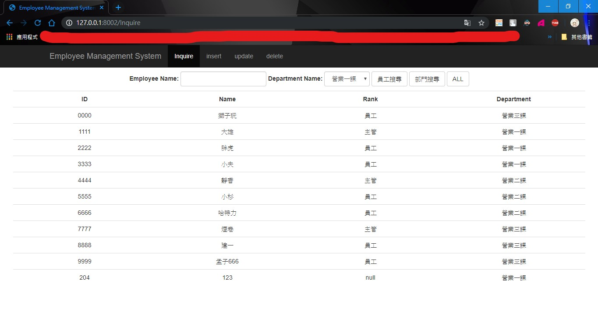

# 10702 資料庫系統實作範例
該範例專案名為「<b>Employee Management System</b>」，
以python做為後端語言，實作一個web server，
該服務可針對資料庫裡的員工資料做
「<b>Inquire</b>、
<b>insert</b>、
<b>update</b>、
<b>delete</b>」四項功能。

#### 目錄內容
* document/：內含作業說明及XAMPP使用教學檔
* DBdata/：內含資料庫匯入需要的xml檔
* static/：專案的css、js、images...
* view/：專案的html
* app.py：主程式
* config.conf：設定檔

#### 環境配置
* Databast：XAMPP -> <b>MariaDB 10</b>
* Database cilent：<b>Navicat Lite free</b>
* Python web server framework：<b>web\.py</b>
* python version：<b>python 3.6+</b>

#### 安裝&執行
1. 請確保PC已安裝python，version為3.6+。(建議使用Anaconda)
    > python -V # Python 3.6.x
2. 安裝**web.py**
    > pip install web.py
3. 網路下載XAMPP，並啟用(Apache、MySQL)
    > XAMPP使用請參考網路教學
4. 建立資料庫資料
    > 這裡可以自行建立或匯入DBdata/*.xml
5. 設定**config.conf**
    > 將**XMAPP**底下的五個設定改成自己的
6. 進入終端機並在該專案目錄底下執行
    > python app.py 8002
7. 進入網頁輸入
    > http://127.0.0.1:8002

#### 資料庫內容

| | | | | |
|----|----|----|----|----|
|**employee**|e_id|name|rank|d_id|
|**department**|d_id|name|e_id|

#### 執行結果
終端機內容

網頁內容
